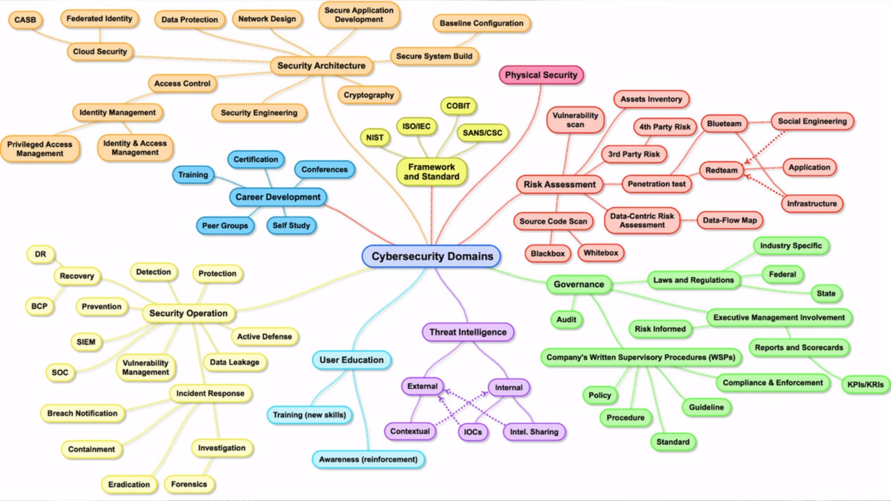
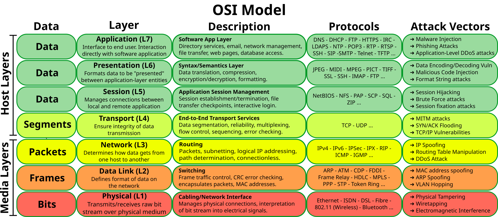
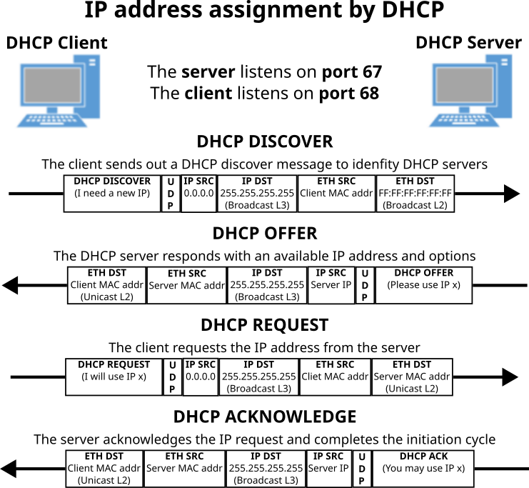

    
# Hi, I'm Robson!
I've a keen interest in cyber security, with a specific focus on security operations encompassing network and endpoint security, traffic and log analysis, digital forensics, incident response, threat hunting, threat intelligence, malware analysis, web applications security, and vulnerability management. Leveraging my GitHub account, I curate homelabs to simulate diverse security operations scenarios. This platform serves as a repository for educational content covering system administration, network administration, and cyber security/security operations. Through these initiatives, I aim to contribute to the dissemination of cyber security knowledge.

# Badges & Skills

# Learning Paths & Courses Certificates
I'm actively engaged in developing my expertise in Cyber Security. I've used LinkedIn Learning to learn about Cyber Security topics and TryHackMe to get hands-on practice with offensive and defensive tools and techniques. I also developed Python and Data Analysis skills using DataCamp.

| Linkedin Learning           | TryHackMe                  | DataCamp|
|-----------------------------|----------------------------|---------------------------|
| 25 Learning Paths Completed | 8 Learning Paths Completed | 2 Career Tracks Completed |
| 200 Courses Completed       | 30 Modules Completed       | 1 Skill Track Completed   |
|                             | 172 Rooms Completed        | 3 Projects Completed      |
|                             |                            | 35 Courses Completed      |
| 374+ hours of learning      | 370+ hours of learning     | 140+ hours of learning    |

(Learning paths and courses completed with total time estimated by the platforms - [**source**](https://github.com/robsann/robsann/blob/main/courses.md))

<!--  -->

<!-- (Word cloud of [courses.md](https://github.com/robsann/robsann/blob/main/courses.md) generated by [wordclouds](https://www.wordclouds.com/)) -->

---
---

<h1 align="center">Cyber Security Projects/Homelabs</h1>

I've been exploring some homelabs described in YouTube channels and blogs on topics such as threat hunting (XDR), endpoint security (EDR), monitoring (SIEM), and network security (IDS/IPS)

## Threat Hunting with Elastic Stack 8 (XDR)
- Configured in VirtualBox an Internal Network with:
    - DHCP Server
    - Ubuntu Server (Elastic Host)
    - Windows 10 (Victim)
- Configured Elastic Stack 8 on Ubuntu Server:
    - Elastic Stack: Elasticsearch, Kibana (UI), and Elastic Agent + Integrations.
    - Integrations: Fleet Server, System, Windows, and Elastic Defend.
- Simulated two malicious tests on the Victim machine:
    - EICAR Malware Test.
    - MITRE ATT&CK Test with Red Team Automation (RTA).

**Source:** https://github.com/robsann/ElasticStackLab
   
## Detection & Response with LimaCharlie (EDR)
- Configured in VirtualBox a NAT Network with:
    - DHCP Server and Host Gateway access.
    - Windows 11 (Target) with Windows Defender disabled, Sysmon and LimaCharlie sensor installed.
    - Ubuntu Server (Attack) with Sliver installed, a Command & Control (C2) framework by BishopFox.
- Generated in Sliver a C2 payload and executed the payload on the Target machine to start a Sliver C2 session on the Attack machine.
- Used the Sliver C2 session to perform two attacks on the Target machine:
    - LSASS access (credential-stealing attack).
    - Volume shadow copies deletion using vssadmin Windows utility (used in ransomware attacks).
- Detection and response rules were created in the LimaCharlie platform to detect the two previous attacks and take action. The rules were tested by repeating the attacks.

**Source:** https://github.com/robsann/LimaCharlieEDRTelemetry
   
## Attack Monitoring with Microsoft Sentinel (SIEM)
- Microsoft Sentinel was used to monitor failed RDP login attempts from global attackers on an exposed Windows 10 virtual machine configured in Microsoft Azure.
- A custom log file (`failed_rdp.log`) was generated using a PowerShell script that extracts failed login events from Security Log on Event Viewer and forwards them to a third-party API to get geolocation data.
- A custom table (`FAILED_RDP_WITH_GEO_CL`) was created in Log Analytics Workspace on Microsoft Azure using the generated log file (`failed_rdp.log`). Custom fields were extracted from the table using a Kusto Query Language (KQL) query.
- A workbook was created in Microsoft Sentinel using KQL to query data from the `FAILED_RDP_WITH_GEO_CL` table to display global attackers (RDP login failure) on the world map according to physical location and magnitude (attack count).

**Source:** https://github.com/robsann/AzureSentinelSIEMAttackMap

## Network Security with Snort (IDS/IPS)
- Snort network IDS mode configuration in Ubuntu Server.
- NMAP scan detection using Snort (NIDS):
    - NMAP Ping Scan, various TCP scans including SYN, Connect, NULL, FIN, and XMAS, as well as UDP Scans.
- Attack detection using Snort (NIDS):
    - SQL injection attacks using tools like WPSCan & WordPress and Burp Suite & SQLmap.
    - Backdoor attacks using Empire post-exploitation framework and Katana penetration test framework.
    - Rogue DHCP & Rogue Routing attacks.
    - ICMP Redirect attack.

**Source:** https://github.com/robsann/NetworkSecurityWithSnort

---
---

<h1 align="center">IT and Cyber Security Fundamentals</h1>

I'm developing educational materials covering IT fundamentals like system and network administration, as well as cyber security fundamentals. I started by creating visual maps to outline the content of various certification exams, including CompTIA A+, CompTIA Linux+, CompTIA Network+, CompTIA Security+, and CompTIA CySA+. You can access these maps in PDF format on Dropbox by clicking on the images.
  

<h2 align="center">System Administration</h2>

### CompTIA A+ Core 2 (220-1102) Objectives - [CompTIA link](https://partners.comptia.org/docs/default-source/resources/comptia-a-220-1102-exam-objectives-(3-0))
The CompTIA A+ Core 2 certification objectives cover advanced troubleshooting, operating systems, security, and software troubleshooting. It includes topics like hardware, networking, mobile devices, virtualization, and cloud computing. Candidates are tested on their ability to secure and manage various devices and technologies, ensuring comprehensive IT skills and knowledge. CompTIA A+ Core 2 demonstrates proficiency in essential IT areas.

### Exam Domains
<li> <b><code>1.0</code> Operating Systems</b></li>
<li> <b><code>2.0</code> Security</b></li>
<li> <b><code>3.0</code> Software Troubleshooting</b></li>
<li> <b><code>4.0</code> Operational Procedures</b></li>
 

**Professor Messer CompTIA A+ Core 2 (220-1102) course: [YouTube Link](https://www.youtube.com/watch?v=3MHDU4kFChU&list=PLG49S3nxzAnna96gzhJrzkii4hH_mgW4b&ab_channel=ProfessorMesser)**

### CompTIA Linux+ (XK0-005) Objectives - [CompTIA link](https://partners.comptia.org/docs/default-source/resources/comptia-linux-xk0-005-exam-objectives-(1-0))
The CompTIA Linux+ certification validates essential skills in Linux system administration and operation. Covering topics such as system architecture, Linux installation, package management, command line usage, file permissions, and security, this certification ensures proficiency in managing Linux-based systems. Candidates learn troubleshooting, scripting, and networking in a Linux environment, making them well-equipped for various IT roles requiring Linux expertise. Achieving CompTIA Linux+ certification demonstrates a thorough understanding of Linux systems.

### Exam Domains
<li> <b><code>1.0</code> System Management</b></li>
<li> <b><code>2.0</code> Security</b></li>
<li> <b><code>3.0</code> Scripting, Containers, and Automation</b></li>
<li> <b><code>4.0</code> Troubleshooting</b></li>
 

**Shawn Powers' CompTIA Linux+ (XK0-005) prep (in progress):** [YouTube Link](https://www.youtube.com/watch?v=niPWk7tgD2Q&list=PL78ppT-_wOmuwT9idLvuoKOn6UYurFKCp&ab_channel=ShawnPowers)
  

<h2 align="center">Network Administration</h2>

### CompTIA Network+ (N10-008) Objectives - [CompTIA link](https://partners.comptia.org/docs/default-source/resources/comptia-network-n10-008-exam-objectives-(2-0))
The CompTIA Network+ certification validates essential skills in networking, covering topics such as network architecture, security, troubleshooting, and cloud technologies. Candidates learn to design and implement functional networks, configure network devices, and manage network security protocols. The certification also emphasizes practical skills in areas like network installation, configuration, and diagnostics, ensuring proficiency in both wired and wireless networks. Overall, CompTIA Network+ certification demonstrates expertise in network administration.

### Exam Domains
<li> <b><code>1.0</code> Networking Fundamentals</b></li>
<li> <b><code>2.0</code> Network Implementations</b></li>
<li> <b><code>3.0</code> Network Operations</b></li>
<li> <b><code>4.0</code> Network Security</b></li>
<li> <b><code>5.0</code> Network Troubleshooting</b></li>
 

**Professor Messer CompTIA Network+ (N10-008) course: [YouTube Link](https://www.youtube.com/watch?v=As6g6IXcVa4&list=PLG49S3nxzAnlCJiCrOYuRYb6cne864a7G)**
  

<h2 align="center">Cyber Security</h2>

### CompTIA Security+ (SY0-501) Objectives - [CompTIA link](https://www.comptia.jp/pdf/Security%2B%20SY0-501%20Exam%20Objectives.pdf)
The CompTIA Security+ certification objectives cover essential topics in cybersecurity, including network security, threats and vulnerabilities, access control, identity management, cryptography, and risk management. It also emphasizes security compliance, incident response, and security architecture. Successfully mastering these objectives demonstrates proficiency in securing IT systems.

### Exam Domains
<li> <b><code>1.0</code> Threats, Attacks and Vulnerabilities</b></li>
<li> <b><code>2.0</code> Technologies and Tools</b></li>
<li> <b><code>3.0</code> Architecture and Design</b></li>
<li> <b><code>4.0</code> Identity and Access Management</b></li>
<li> <b><code>5.0</code> Risk Management</b></li>
<li> <b><code>6.0</code> Cryptography and PKI</b></li>
 

**Professor Messer's CompTIA Security+ (SY0-501) course: [YouTube Link](https://www.youtube.com/watch?v=JU5zkddWits&list=PLG49S3nxzAnnVhoAaL4B6aMFDQ8_gdxAy&ab_channel=ProfessorMesser)**

### CompTIA Cybersecurity Analyst (CySA+) (CS0-003) Objectives - [CompTIA link](https://partners.comptia.org/docs/default-source/resources/comptia-cysa-cs0-003-exam-objectives-2-0.pdf)
The CompTIA Cybersecurity Analyst (CySA+) certification focuses on identifying and responding to security threats and vulnerabilities in a cybersecurity context. CySA+ certified professionals demonstrate skills in threat detection, analysis, and response using various tools and techniques. They are proficient in analyzing data to identify vulnerabilities, threats, and risks to an organization's information systems. CySA+ certification validates expertise in cybersecurity operations, enhancing an individual's ability to protect and secure organizational assets against cyber threats.

### Exam Domains
<li> <b><code>1.0</code> Security Operations</b></li>
<li> <b><code>2.0</code> Vulnerability Management</b></li>
<li> <b><code>3.0</code> Incident Response and Management</b></li>
<li> <b><code>4.0</code> Reporting and Communication</b></li>
 

### Cyber Security Domains Mind Map from 2017 (credits to [MyDFIR](https://www.youtube.com/@MyDFIR))
Mind map from 2017 that provides a comprehensive overview of the various domains within cyber security.

### Hands-on Platforms
- **TryHackMe:** Hands-on offensive and defensive cyber security training - https://tryhackme.com/
- **LetsDefend:** Hands-on security operations training - https://letsdefend.io/
- **CyberDefenders:** A blue team training platform - https://cyberdefenders.org/

---
---

<h1 align="center">Essentials of Cyber</h1>

# OSI Model
The OSI Model (Open Systems Interconnection Model) is a conceptual framework used to describe the functions of a networking system. The OSI model characterizes computing functions into a universal set of rules and requirements in order to support interoperability between different products and software.

 

# DHCP
The Dynamic Host Configuration Protocol (DHCP) is a network management protocol used on IP networks for automatically assigning IP addresses and other communication parameters to devices connected to the network using a client–server architecture.

 

<!--
**robsann/robsann** is a ✨ _special_ ✨ repository because its `README.md` (this file) appears on your GitHub profile.

Here are some ideas to get you started:

- 🔭 I’m currently working on ...
- 🌱 I’m currently learning ...
- 👯 I’m looking to collaborate on ...
- 🤔 I’m looking for help with ...
- 💬 Ask me about ...
- 📫 How to reach me: ...
- 😄 Pronouns: ...
- ⚡ Fun fact: ...
-->
