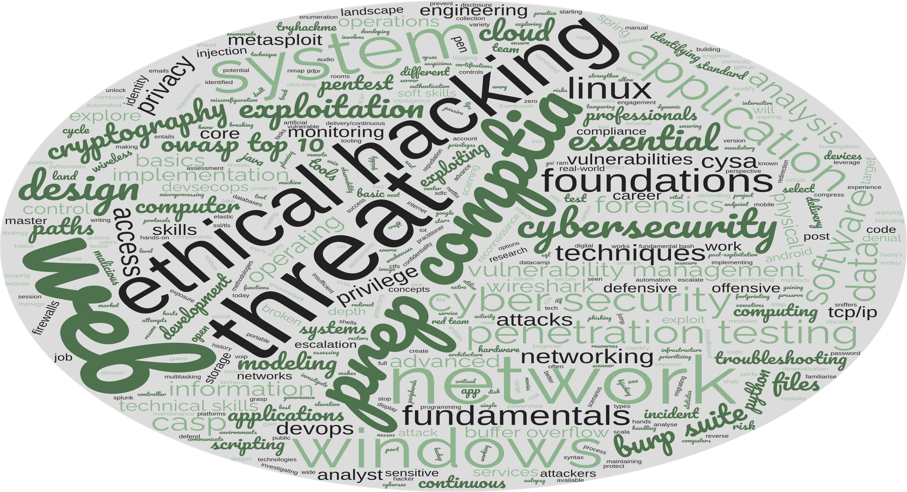

# Hi, I'm Robson!

I'm a self-taught Cyber Security learner interested in Cyber Defense topics such as network and endpoint security, traffic and log analysis, digital forensics and incident response, threat hunting, threat intelligence, malware analysis, web applications security, and vulnerability management.
  
    
# Badges & Skills

  

# Learning Paths & Courses Credentials
I've been using Linkedin Learning to learn Cyber Security topics and tools and TryHackMe to get hands-on practice with offensive and defensive tools and techniques. I also used DataCamp to learn Python and Data Analysis.

| [Linkedin Learning](https://github.com/robsann/robsann/blob/main/courses.md#linkedin-learning)            | [TryHackMe](https://github.com/robsann/robsann/blob/main/courses.md#tryhackme)                  | [DataCamp](https://github.com/robsann/robsann/blob/main/courses.md#datacamp)                  |
|-----------------------------|----------------------------|---------------------------|
| 25 Learning Paths Completed | 8 Learning Paths Completed | 2 Career Tracks Completed |
| 200 Courses Completed       | 30 Modules Completed       | 1 Skill Track Completed   |
|                             | 172 Rooms Completed        | 3 Projects Completed      |
|                             |                            | 35 Courses Completed      |
| 374+ hours of learning      | 370+ hours of learning     | 140+ hours of learning    |

(Completed learning paths and courses with duration time estimated by the platforms)

<!--  -->

<!-- (Word cloud of [courses.md](https://github.com/robsann/robsann/blob/main/courses.md) generated by [wordclouds](https://www.wordclouds.com/)) -->

  

# Cyber Security Projects/Homelabs
I've been exploring some homelabs described in Youtube channels and blogs and plan to build new ones at some point.

## Threat Hunting with Elastic Stack 8 (XDR) - [GitHub repository](https://github.com/robsann/ElasticStackLab)
- Configured in VirtualBox an Internal Network with:
    - DHCP Server
    - Ubuntu Server (Elastic Host)
    - Windows 10 (Victim)
- Configured Elastic Stack 8 on Ubuntu Server:
    - Elastic Stack: Elasticsearch, Kibana (UI), and Elastic Agent + Integrations.
    - Integrations: Fleet Server, System, Windows, and Elastic Defend.
- Simulated two malicious tests on Victim machine:
    - EICAR Malware Test.
    - MITRE ATT&CK Test with Red Team Automation (RTA).

## Detection & Response with LimaCharlie (EDR) - [GitHub repository](https://github.com/robsann/LimaCharlieEDRTelemetry)
- Configured in VirtualBox a NAT Network with:
    - DHCP Server and Host Gateway access.
    - Windows 11 (Target) with Windows Defender disabled, Sysmon and LimaCharlie sensor installed.
    - Ubuntu Server (Attack) with Sliver installed, a Command & Control (C2) framework by BishopFox.
- Generated in Sliver a C2 payload and executed the payload on the Target machine to start a Sliver C2 session on the Attack machine.
- Used the Sliver C2 session to perform two attacks on the Target machine:
    - LSASS access (credential-stealing attack).
    - Volume shadow copies deletion using vssadmin Windows utility (used in ransomware attacks).
- Detection and response rules were created in the LimaCharlie platform to detect the two previous attacks and take action. The rules were tested by repeating the attacks.

## Attack Monitoring with Microsoft Sentinel (SIEM) - [GitHub repository](https://github.com/robsann/AzureSentinelSIEMAttackMap)
- Microsoft Sentinel was used to monitor failed RDP login attempts from global attackers on an exposed Windows 10 virtual machine configured in Microsoft Azure.
- A custom log file (`failed_rdp.log`) was generated using a PowerShell script that extracts failed login events from Security Log on Event Viewer and forwards them to a third-party API to get geolocation data.
- A custom table (`FAILED_RDP_WITH_GEO_CL`) was created in Log Analytics Workspace on Microsoft Azure using the generated log file (`failed_rdp.log`). Custom fields were extracted from the table using a Kusto Query Language (KQL) query.
- A workbook was created in Microsoft Sentinel using KQL to query data from the `FAILED_RDP_WITH_GEO_CL` table to display global attackers (RDP login failure) on the world map according to physical location and magnitude (attack count).

<!-- 
## Pentesting & Network Security with Snort (IDS/IPS) - Under Development
- Network IDS/IPS setup using Snort in Ubuntu.
- NMAP scan detection using Snort (NIDS):
    - NMAP Ping Scan, TCP Scan, XMAS Scan, FIN Scan, NULL Scan, and UDP Scan.
- Attack detection using Snort (NIDS):
    - SQL injection attacks using WPSCan & WordPress and Burp Suite & SQLmap.
    - Backdoor attacks using Empire and Katana.
    - Rogue DHCP & Rogue Routing attacks.
    - ICMP Redirect attack. 
-->

  

# CompTIA Certification Exam Objectives Maps

I created some maps to overview the contents of the CompTIA A+, Linux+, Network+, Security+, and CySA+ Certification Exam Objectives. Click on the maps to see them in PDF on Dropbox.

### CompTIA A+ Core 2 (220-1102) Objectives - [CompTIA link](https://partners.comptia.org/docs/default-source/resources/comptia-a-220-1102-exam-objectives-(3-0))

### Exam Domains
<li> <b><code>1.0</code> Operating Systems</b></li>
<li> <b><code>2.0</code> Security</b></li>
<li> <b><code>3.0</code> Software Troubleshooting</b>b></li>
<li> <b><code>4.0</code> Operational Procedures</b>b></li>
 

### CompTIA Linux+ (xk0-005) Objectives - [CompTIA link](https://partners.comptia.org/docs/default-source/resources/comptia-linux-xk0-005-exam-objectives-(1-0))

### Exam Domains
<li> <b><code>1.0</code> System Management</b></li>
<li> <b><code>2.0</code> Security</b></li>
<li> <b><code>3.0</code> Scripting, Containers, and Automation</b></li>
<li> <b><code>4.0</code> Troubleshooting</b></li>
 

### CompTIA Network+ (n10-008) Objectives - [CompTIA link](https://partners.comptia.org/docs/default-source/resources/comptia-network-n10-008-exam-objectives-(2-0))

### Exam Domains
<li> <b><code>1.0</code> Networking Fundamentals</b></li>
<li> <b><code>2.0</code> Network Implementations</b></li>
<li> <b><code>3.0</code> Network Operations</b></li>
<li> <b><code>4.0</code> Network Security</b></li>
<li> <b><code>5.0</code> Network Troubleshooting</b></li>
 

### CompTIA Security+ (SY0-501) Objectives - [CompTIA link](https://www.comptia.jp/pdf/Security%2B%20SY0-501%20Exam%20Objectives.pdf)

### Exam Domains
<li> <b><code>1.0</code> Threats, Attacks and Vulnerabilities</b></li>
<li> <b><code>2.0</code> Technologies and Tools</b></li>
<li> <b><code>3.0</code> Architecture and Design</b></li>
<li> <b><code>4.0</code> Identity and Access Management</b></li>
<li> <b><code>5.0</code> Risk Management</b></li>
<li> <b><code>6.0</code> Cryptography and PKI</b></li>
 

### CompTIA Cybersecurity Analyst (CySA+) (CS0-003) Objectives - [CompTIA link](https://partners.comptia.org/docs/default-source/resources/comptia-cysa-cs0-003-exam-objectives-2-0.pdf)

### Exam Domains
<li> <b><code>1.0</code> Security Operations</b></li>
<li> <b><code>2.0</code> Vulnerability Management</b></li>
<li> <b><code>3.0</code> Incident Response and Management</b></li>
<li> <b><code>4.0</code> Reporting and Communication</b></li>
  

<!--
**robsann/robsann** is a ✨ _special_ ✨ repository because its `README.md` (this file) appears on your GitHub profile.

Here are some ideas to get you started:

- 🔭 I’m currently working on ...
- 🌱 I’m currently learning ...
- 👯 I’m looking to collaborate on ...
- 🤔 I’m looking for help with ...
- 💬 Ask me about ...
- 📫 How to reach me: ...
- 😄 Pronouns: ...
- ⚡ Fun fact: ...
-->
