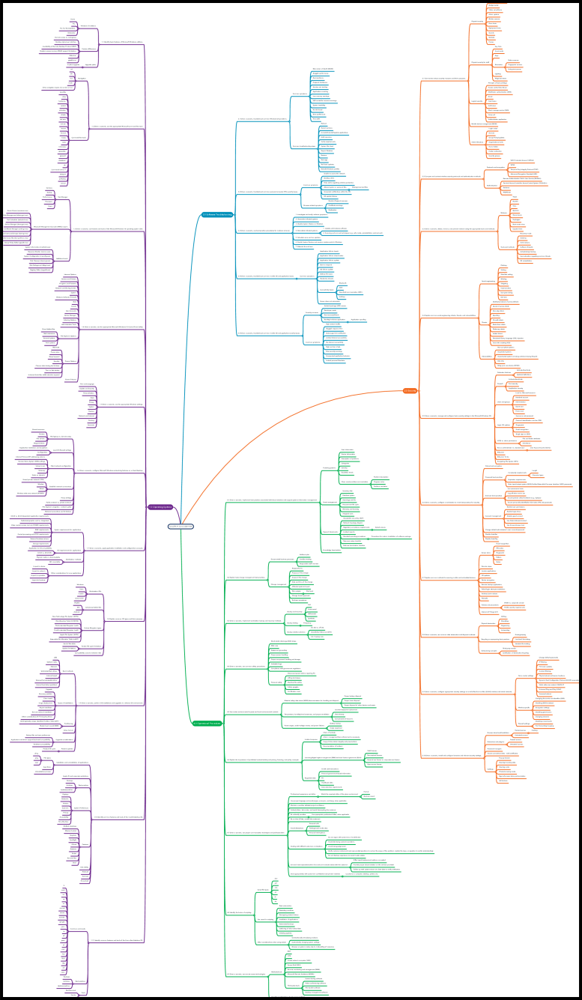
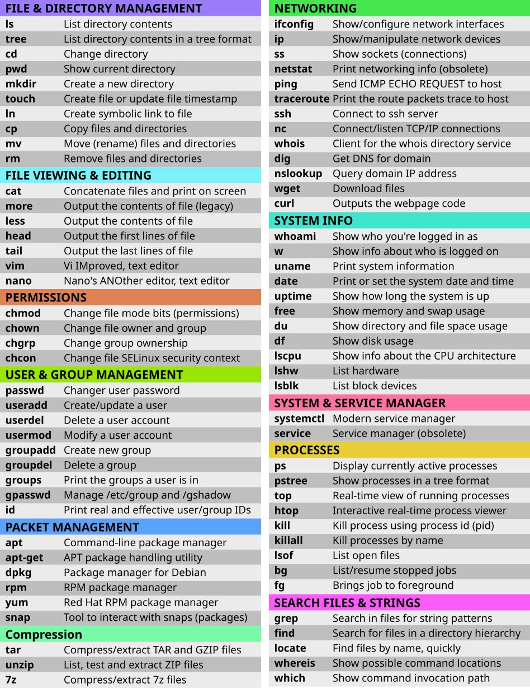
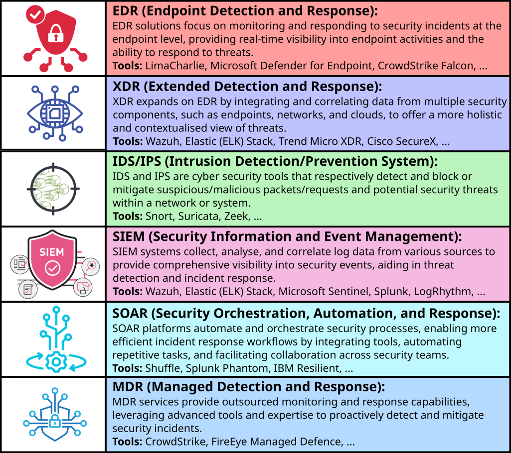
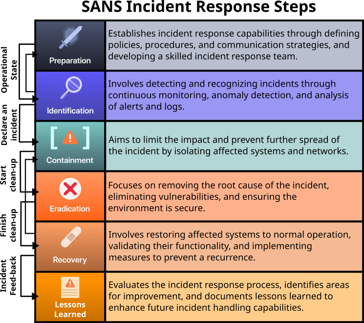
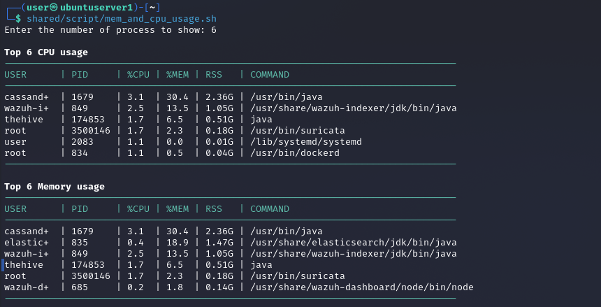
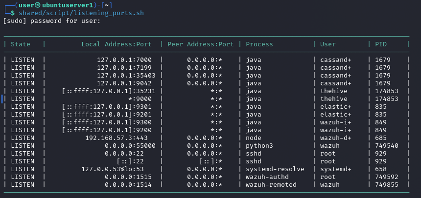
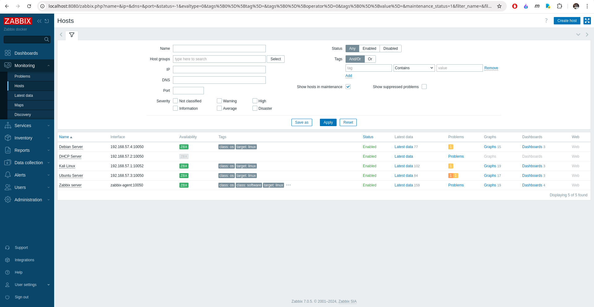
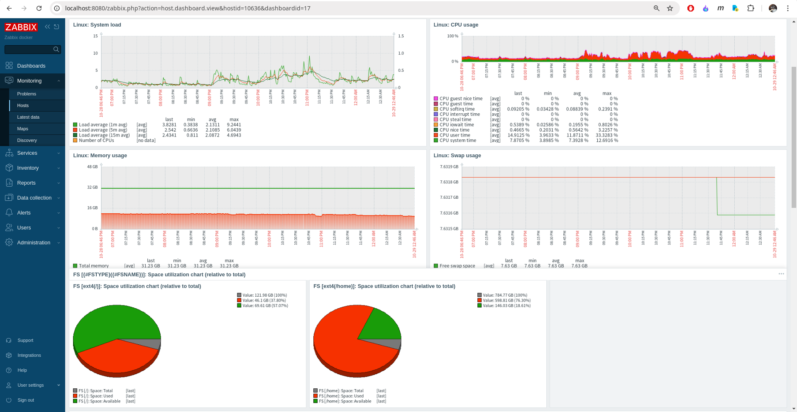

    
# Hi, I'm Robson

I have extensive programming experience and a keen interest in Cyber Ssecurity, with a focus on security operations and data flow automation. I leverage my GitHub account to curate homelabs to simulate various security operations scenarios and test tools used in Security Operations Centers (SOCs). Additionally, whenever possible, I try to create some small snippets of content covering topics in systems administration, network administration, and cybersecurity. My certificates can be found [here](https://github.com/robsann/robsann/blob/main/docs/certificates.md).

## Outline

- [Cyber Security Homelabs](#cyber-security-homelabs)
- [IT and Cyber Security Popular Certifications](#it-and-cyber-sec-certs)
- [NIST Standards Overview](#nist-standards-overview)
- [IT and Cyber Security Concepts](#it-and-cyber-security-concepts)
- [Other Stuff](#other-stuff)

----------------------------------------------------------------------------------------------------

<h1 align="center" id="cyber-security-homelabs">🌱 Cyber Security Homelabs</h1>

I have been exploring various homelabs featured in YouTube channels and blogs, focusing on topics like threat hunting (XDR), endpoint security (EDR), network security (IDS/IPS), and log monitoring (SIEM). I have been documenting step-by-step procedures for setting up these labs in a self-hosted, cost-free manner.

<h2 id="elastic-stack">Threat Hunting with Elastic Stack 8 (XDR)</h2>

- Configured in VirtualBox an Internal Network with:
    - DHCP Server
    - Ubuntu Server (Elastic Host)
    - Windows 10 (Victim)
- Configured Elastic Stack 8 on Ubuntu Server:
    - Elastic Stack: Elasticsearch, Kibana (UI), and Elastic Agent + Integrations.
    - Integrations: Fleet Server, System, Windows, and Elastic Defend.
- Simulated two malicious tests on the Victim machine:
    - EICAR Malware Test.
    - MITRE ATT&CK Test with Red Team Automation (RTA).

**Source:** https://github.com/robsann/ElasticStackLab

<h2 id="limacharlie">Detection & Response with LimaCharlie (EDR)</h2>

- Configured in VirtualBox a NAT Network with:
    - DHCP Server and Host Gateway access.
    - Windows 11 (Target) with Windows Defender disabled, Sysmon and LimaCharlie sensor installed.
    - Ubuntu Server (Attack) with Sliver installed, a Command & Control (C2) framework by BishopFox.
- Generated in Sliver a C2 payload and executed the payload on the Target machine to start a Sliver C2 session on the Attack machine.
- Used the Sliver C2 session to perform two attacks on the Target machine:
    - LSASS access (credential-stealing attack).
    - Volume shadow copies deletion using vssadmin Windows utility (used in ransomware attacks).
- Detection and response rules were created in the LimaCharlie platform to detect the two previous attacks and take action. The rules were tested by repeating the attacks.

**Source:** https://github.com/robsann/LimaCharlieEDRTelemetry

<h2 id="snort">Network Security with Snort (IDS/IPS)</h2>

- Snort network IDS mode configuration in Ubuntu Server.
- NMAP scan detection using Snort (NIDS):
    - NMAP Ping Scan, various TCP scans including SYN, Connect, NULL, FIN, and XMAS, as well as UDP Scans.
- Attack detection using Snort (NIDS):
    - SQL injection attacks using tools like WPSCan & WordPress and Burp Suite & SQLmap.
    - Backdoor attacks using Empire post-exploitation framework and Katana penetration test framework.
    - Rogue DHCP & Rogue Routing attacks.
    - ICMP Redirect attack.

**Source:** https://github.com/robsann/NetworkSecurityWithSnort

<h2 id="microsoft-sentinel">Attack Monitoring with Microsoft Sentinel (SIEM)</h2>

- Microsoft Sentinel was used to monitor failed RDP login attempts from global attackers on an exposed Windows 10 virtual machine configured in Microsoft Azure.
- A custom log file (`failed_rdp.log`) was generated using a PowerShell script that extracts failed login events from Security Log on Event Viewer and forwards them to a third-party API to get geolocation data.
- A custom table (`FAILED_RDP_WITH_GEO_CL`) was created in Log Analytics Workspace on Microsoft Azure using the generated log file (`failed_rdp.log`). Custom fields were extracted from the table using a Kusto Query Language (KQL) query.
- A workbook was created in Microsoft Sentinel using KQL to query data from the `FAILED_RDP_WITH_GEO_CL` table to display global attackers (RDP login failure) on the world map according to physical location and magnitude (attack count).

**Source:** https://github.com/robsann/AzureSentinelSIEMAttackMap

----------------------------------------------------------------------------------------------------

<h1 align="center" id="it-and-cyber-sec-certs">📝 IT and Cyber Security Popular Certifications</h1>

A brief overview of popular CompTIA certifications, with mind maps detailing exam domains and links to related YouTube resources is provided here. This includes System Administration and Network Administration certifications such as CompTIA A+, CompTIA Linux+, and CompTIA Network+, as well as Cyber Security certifications like CompTIA Security+ and CompTIA CySA+. You can access these mind maps in high-resolution PDF format on Dropbox by clicking on the images.

<h2 id="system-administration-cert">System Administration Certifications</h2>

### CompTIA A+ Core 2 (220-1102) Objectives - [CompTIA link](https://partners.comptia.org/docs/default-source/resources/comptia-a-220-1102-exam-objectives-(3-0))

The CompTIA A+ Core 2 certification objectives cover advanced troubleshooting, operating systems, security, and software troubleshooting. It includes topics like hardware, networking, mobile devices, virtualization, and cloud computing. Candidates are tested on their ability to secure and manage various devices and technologies, ensuring comprehensive IT skills and knowledge. CompTIA A+ Core 2 demonstrates proficiency in essential IT areas.

#### Exam Domains

<li> <b><code>1.0</code> Operating Systems</b></li>
<li> <b><code>2.0</code> Security</b></li>
<li> <b><code>3.0</code> Software Troubleshooting</b></li>
<li> <b><code>4.0</code> Operational Procedures</b></li>
 

**Professor Messer CompTIA A+ Core 2 (220-1102) course - [YouTube Link](https://www.youtube.com/watch?v=3MHDU4kFChU&list=PLG49S3nxzAnna96gzhJrzkii4hH_mgW4b&ab_channel=ProfessorMesser)**

### CompTIA Linux+ (XK0-005) Objectives - [CompTIA link](https://partners.comptia.org/docs/default-source/resources/comptia-linux-xk0-005-exam-objectives-(1-0))

The CompTIA Linux+ certification validates essential skills in Linux system administration and operation. Covering topics such as system architecture, Linux installation, package management, command line usage, file permissions, and security, this certification ensures proficiency in managing Linux-based systems. Candidates learn troubleshooting, scripting, and networking in a Linux environment, making them well-equipped for various IT roles requiring Linux expertise. Achieving CompTIA Linux+ certification demonstrates a thorough understanding of Linux systems.

#### Exam Domains

<li> <b><code>1.0</code> System Management</b></li>
<li> <b><code>2.0</code> Security</b></li>
<li> <b><code>3.0</code> Scripting, Containers, and Automation</b></li>
<li> <b><code>4.0</code> Troubleshooting</b></li>
 

**Shawn Powers' CompTIA Linux+ (XK0-005) prep (in progress) - [YouTube Link](https://www.youtube.com/watch?v=niPWk7tgD2Q&list=PL78ppT-_wOmuwT9idLvuoKOn6UYurFKCp&ab_channel=ShawnPowers)**

<h2 id="network-administration-cert">Network Administration Certifications</h2>

### CompTIA Network+ (N10-008) Objectives - [CompTIA link](https://partners.comptia.org/docs/default-source/resources/comptia-network-n10-008-exam-objectives-(2-0))

The CompTIA Network+ certification validates essential skills in networking, covering topics such as network architecture, security, troubleshooting, and cloud technologies. Candidates learn to design and implement functional networks, configure network devices, and manage network security protocols. The certification also emphasizes practical skills in areas like network installation, configuration, and diagnostics, ensuring proficiency in both wired and wireless networks. Overall, CompTIA Network+ certification demonstrates expertise in network administration.

#### Exam Domains

<li> <b><code>1.0</code> Networking Fundamentals</b></li>
<li> <b><code>2.0</code> Network Implementations</b></li>
<li> <b><code>3.0</code> Network Operations</b></li>
<li> <b><code>4.0</code> Network Security</b></li>
<li> <b><code>5.0</code> Network Troubleshooting</b></li>
 

**Professor Messer CompTIA Network+ (N10-008) course - [YouTube Link](https://www.youtube.com/watch?v=As6g6IXcVa4&list=PLG49S3nxzAnlCJiCrOYuRYb6cne864a7G)**

<h2 id="cyber-security-cert">Cyber Security Certifications</h2>

### CompTIA Security+ (SY0-501) Objectives - [CompTIA link](https://www.comptia.jp/pdf/Security%2B%20SY0-501%20Exam%20Objectives.pdf)

The CompTIA Security+ certification objectives cover essential topics in cybersecurity, including network security, threats and vulnerabilities, access control, identity management, cryptography, and risk management. It also emphasizes security compliance, incident response, and security architecture. Successfully mastering these objectives demonstrates proficiency in securing IT systems.

#### Exam Domains

<li> <b><code>1.0</code> Threats, Attacks and Vulnerabilities</b></li>
<li> <b><code>2.0</code> Technologies and Tools</b></li>
<li> <b><code>3.0</code> Architecture and Design</b></li>
<li> <b><code>4.0</code> Identity and Access Management</b></li>
<li> <b><code>5.0</code> Risk Management</b></li>
<li> <b><code>6.0</code> Cryptography and PKI</b></li>
 

**Professor Messer's CompTIA Security+ (SY0-501) course - [YouTube Link](https://www.youtube.com/watch?v=JU5zkddWits&list=PLG49S3nxzAnnVhoAaL4B6aMFDQ8_gdxAy&ab_channel=ProfessorMesser)**

### CompTIA Cybersecurity Analyst (CySA+) (CS0-003) Objectives - [CompTIA link](https://partners.comptia.org/docs/default-source/resources/comptia-cysa-cs0-003-exam-objectives-2-0.pdf)

The CompTIA Cybersecurity Analyst (CySA+) certification focuses on identifying and responding to security threats and vulnerabilities in a cybersecurity context. CySA+ certified professionals demonstrate skills in threat detection, analysis, and response using various tools and techniques. They are proficient in analyzing data to identify vulnerabilities, threats, and risks to an organization's information systems. CySA+ certification validates expertise in cybersecurity operations, enhancing an individual's ability to protect and secure organizational assets against cyber threats.

#### Exam Domains

<li> <b><code>1.0</code> Security Operations</b></li>
<li> <b><code>2.0</code> Vulnerability Management</b></li>
<li> <b><code>3.0</code> Incident Response and Management</b></li>
<li> <b><code>4.0</code> Reporting and Communication</b></li>
 

<h2 id="cyber-security-resources">Cyber Security Resources</h2>

### Cyber Security Domains from 2021 (credits to [MyDFIR](https://www.youtube.com/@MyDFIR))

Mind map from 2021 that provides a comprehensive overview of the various domains within cyber security.

### Hands-on Platforms for Cyber Security Operations

- **[LetsDefend](https://letsdefend.io/):** Hands-on security operations training with alert addressing on simulated SOC environment.
- **[CyberDefenders](https://cyberdefenders.org/):** A blue team training platform.
- **[TryHackMe](https://tryhackme.com/):** Hands-on cyber security training with offensive and defensive paths.
- **[HackTheBox](https://www.hackthebox.com/):** Hands-on cyber security training with offensive and defensive paths.

----------------------------------------------------------------------------------------------------

<h1 align="center" id="nist-standards-overview">📁 NIST Standards Overview</h1>

<h3 id="cyber-security-resources">The NIST Cybersecurity Framework (CSF) 2.0</h3>

- The NIST Cybersecurity Framework (CSF) 2.0 is a set of guidelines and best practices for **managing cybersecurity risks**.
- It provides a common language for organizations to **communicate about cybersecurity** and **assess** their current **cybersecurity posture**.
- The framework helps organizations **identify**, **protect**, **detect**, **respond** to, and **recover** from cybersecurity threats.
- It is a flexible and customizable tool that can be adapted to meet the specific needs of different organizations.

### Table of Contents

<li><b><code>1.</code>Cybersecurity Framework (CSF) Overview</b></li>
<li><b><code>2.</code>Introduction to the CSF Core</b></li>
<li><b><code>3.</code>Introduction to CSF Profiles and Tiers</b></li>
<li><b><code>4.</code>Introduction to Online Resources That Supplement the CSF</b></li>
<li><b><code>5.</code>Improving Cybersecurity Risk Communication and Integration</b></li>

     

<h3 id="nist-sp-800-12">NIST SP 800-12 Rev. 1:  An Introduction to Information Security</h3>

- NIST SP 800-12 Rev. 1 is a publication that serves as an introduction to information security.
- It provides guidance on understanding the importance of **information security**, the **risks and threats** that organizations face, and the best practices for **protecting information assets**.
- The document covers topics such as **security policies**, **risk management**, **security controls**, and **incident response**.
- It is designed to help organizations establish a strong foundation for their information security programs and ensure the confidentiality, integrity, and availability of their data and systems.

### Table of Content

<li><b><code>1.</code>Introduction</b></li>
<li><b><code>2.</code>Elements of Information Security</b></li>
<li><b><code>3.</code>Roles and Responsibilities</b></li>
<li><b><code>4.</code>Threats and Vulnerabilities: A Brief Overview</b></li>
<li><b><code>5.</code>Information Security Policy</b></li>
<li><b><code>6.</code>Information Security Risk Management</b></li>
<li><b><code>7.</code>Assurance</b></li>
<li><b><code>8.</code>Security Considerations in System Support and Operations</b></li>
<li><b><code>9.</code>Cryptography</b></li>
<li><b><code>10.</code>Control Families</b></li>

<h3 id="nist-sp-800-37">NIST SP 800-37 Rev. 2:  Risk Management Framework for Information Systems and Organizations</h3>

- NIST SP 800-37 Rev. 2 is a publication that outlines a structured approach to managing risks associated with information systems and organizations.
- The framework provides a systematic process for **identifying, assessing, and responding to risks**, with the goal of protecting critical assets and ensuring the confidentiality, integrity, and availability of information.
- It emphasizes **continuous monitoring and improvement**, as well as **collaboration** between stakeholders to effectively manage and mitigate risks.
- The framework is designed to be flexible and scalable, making it applicable to organizations of all sizes and industries.

### Table of Contents

<li><b><code>1.</code>Introduction</b></li>
<li><b><code>2.</code>The Fundamentals</b></li>
<li><b><code>3.</code>The Process</b></li>

         

<h3 id="nist-sp-800-53">NIST SP 800-53 Rev. 5:  Security and Privacy Controls for Information Systems and Organizations</h3>

- NIST SP 800-53 Rev. 5 is a publication that provides a comprehensive set of security and privacy controls for information systems and organizations.
- These controls are designed to help organizations **protect** their **sensitive information** and **systems** from **various threats**, including **cyber attacks**, **data breaches**, and **unauthorized access**.
- The publication outlines a framework for implementing **security and privacy measures**, including **policies**, **procedures**, and **technical safeguards**, to ensure the confidentiality, integrity, and availability of information.
- It is widely used by government agencies, private sector organizations, and other entities to enhance their cybersecurity posture and compliance with regulations.

### Table of Contents

<li><b><code>1.</code>Introduction</b></li>
<li><b><code>2.</code>The Fundamentals</b></li>
<li><b><code>3.</code>The Controls</b></li>

         

<h3 id="nist-sp-800-61">NIST SP 800-61 Rev 2:  Computer Security Incident Handling Guide</h3>

- NIST SP 800-61 Rev 2 is a comprehensive guide to help organizations effectively respond to and manage computer security incidents.
- It provides a structured approach for **handling incidents**, including **preparation**, **detection**, **analysis**, **containment**, **eradication**, **recovery**, and **post-incident activities**.
- The guide outlines best practices for **incident response**, including **establishing an incident response team**, **creating incident response policies and procedures**, and **conducting post-incident reviews** to improve future incident handling.
- By following the guidelines outlined in NIST SP 800-61 Rev 2, organizations can better protect their systems and data from cyber threats.

### Table of Contents

<b>Executive Summary</b>

<li><b><code>1.</code>Introduction</b></li>
<li><b><code>2.</code>Organizing a Computer Security Incident Response Capability</b></li>
<li><b><code>3.</code>Handling an Incident</b></li>
<li><b><code>4.</code>Coordination and Information Sharing</b></li>

      

<h3 id="nist-sp-800-63-3">NIST SP 800-63-3:  Digital Identity Guidelines</h3>

- NIST SP 800-63-3 is a set of guidelines created to help organizations improve the security and usability of digital identity systems.
- The guidelines provide recommendations for **identity proofing**, **authentication**, and **lifecycle management**, with a focus on **protecting against identity theft and fraud**.
- By following these guidelines, organizations can enhance the security of their digital systems and better protect the privacy and security of their users' identities.

### Table of Contents

<li><b><code>1.</code>Purpose</b></li>
<li><b><code>2.</code>Introduction</b></li>
<li><b><code>3.</code>Definitions and Abbreviations</b></li>
<li><b><code>4.</code>Digital Identity Model</b></li>
<li><b><code>5.</code>Digital Identity Risk Management</b></li>
<li><b><code>6.</code>Selecting Assurance Levels</b></li>
<li><b><code>7.</code>Federation Considerations</b></li>
<li><b><code>8.</code>References</b></li>

  

<h3 id="nist-sp-800-82">NIST SP 800-82 Rev. 3:  Guide to Operational Technology (OT) Security</h3>

- NIST SP 800-82 Rev. 3 is a guide developed to help organizations secure their Operational Technology (OT) systems.
- It provides recommendations and best practices for **protecting OT systems**, which are used to **monitor and control physical processes in industries** such as **manufacturing**, **energy**, and **transportation**.
- The guide covers topics such as **risk management**, **access control**, **network security**, and **incident response**, helping organizations to identify and mitigate potential threats to their OT systems and ensure the reliability and safety of their operations.

### Table of Contents

<li><b><code>1.</code>Introduction</b></li>
<li><b><code>2.</code>OT Overview</b></li>
<li><b><code>3.</code>OT Cybersecurity Program Development</b></li>
<li><b><code>4.</code>Risk Management for OT Systems</b></li>
<li><b><code>5.</code>OT Cybersecurity Architecture</b></li>
<li><b><code>6.</code>Applying the Cybersecurity Framework to OT</b></li>

     

<h3 id="nist-sp-800-115">NIST SP 800-115:  Technical Guide to Information Security Testing and Assessment</h3>

- NIST SP 800-115 is a technical guide that provides organizations with guidance on conducting information security testing and assessments.
- The document outlines best practices for evaluating the **effectiveness of security controls**, **identifying vulnerabilities**, and **assessing the overall security posture** of an organization's **systems and networks**.
- It covers various **testing methodologies**, **tools**, and **techniques** that can be used to assess the security of an organization's information systems.
- The guide aims to help organizations improve their security posture and protect their sensitive information from cyber threats.

### Table of Contents

Executive Summary

<li><b><code>1.</code>Introduction</b></li>
<li><b><code>2.</code>Security Testing and Examination Overview</b></li>
<li><b><code>3.</code>Review Techniques</b></li>
<li><b><code>4.</code>Target Identification and Analysis Techniques</b></li>
<li><b><code>5.</code>Target Vulnerability Validation Techniques</b></li>
<li><b><code>6.</code>Security Assessment Planning</b></li>
<li><b><code>7.</code>Security Assessment Execution</b></li>
<li><b><code>8.</code>Post-Testing Activities</b></li>

 

----------------------------------------------------------------------------------------------------

<h1 align="center" id="it-and-cyber-security-concepts">💾 IT and Cyber Security Concepts</h1>

Below are brief descriptions accompanied by images to help illustrate popular concepts in IT and Cyber Security.

<h2 id="sysadmin-concepts">SysAdmin Concepts</h2>

### Linux File System

The Linux File System is a hierarchical structure that organizes and stores files on a Linux system. It uses a tree-like directory structure, starting with the root directory ("/"), with directories and files arranged systematically to facilitate efficient file management and access.

 

### Linux File Permissions

Linux File Permissions dictate the access level of users (owner, group, and others) to files and directories. They are represented by read, write, and execute permissions, providing control over file security and user interactions.

 

### Linux Useful Commands

Linux commands help users navigate the file system, interact with the files, and administer the entire system using the command line interface.

**Note:** Use the `man` command to display the manual page for other commands (e.g., `man ls`), providing detailed documentation and usage instructions, or use the `--help` option (e.g., `ls --help`) for a quick overview of the command options.

 

### Linux Useful Files

- **Configuration files (/etc/)** store system-wide settings, preferences, and configurations for various applications, facilitating centralized management.
- **System Info files (/proc/)** provide a virtual file system exposing kernel and process information, allowing dynamic access to real-time system details and parameters.
- **Log files (/var/log/)** store system and application logs, aiding in troubleshooting by capturing events, errors, and diagnostic information for analysis and monitoring.

 

<h2 id="networking-concepts">Networking Concepts</h2>

### OSI Model

The Open Systems Interconnection (OSI) model is a conceptual framework used to describe how network communications work. The OSI model characterizes computing functions into a universal set of rules and requirements in order to support interoperability between different products and software.

 

### TCP vs UDP

TCP (Transmission Control Protocol) is a connection-oriented and reliable transport layer protocol, that ensures data integrity and ordered delivery. UDP (User Datagram Protocol) is a connectionless and lightweight transport layer protocol that sacrifices reliability for reduced latency, making it suitable for real-time applications where occasional data loss is acceptable.

 

### DHCP

The Dynamic Host Configuration Protocol (DHCP) is a network management protocol used on IP networks that in 4 steps, automatically assigns IP addresses and other communication parameters to devices connected to the network using a client-server architecture.

 

### DNS

The Domain Name System (DNS) is a naming database that translates human-readable domain names (e.g., www.example.com) to machine-readable IP addresses (e.g., 93.184.216.34) used for device communication. If the website is not cached, the DNS resolver will query Root Servers, Top-Level Domain (TLD) Servers, and Authoritative Nameservers to retrieve the IP address.

 

<h2 id="cyber-security-concepts">Cyber Security Concepts</h2>

### The CIA Triad

The CIA Triad is a fundamental concept in information security, representing the core principles of **Confidentiality** (ensuring data privacy), **Integrity** (maintaining data accuracy and trustworthiness), and **Availability** (ensuring data accessibility). These principles guide security measures and strategies to protect information assets in various computing environments.

 

### The Cyber Kill Chain

The Cyber Kill Chain is a framework outlining the stages of a cyber attack, from initial reconnaissance to achieving the attacker's objectives, providing a structured approach for understanding, analyzing, and defending against advanced cyber threats.

 

### MITRE ATT&CK Matrix

[MITRE ATT&CK (Adversarial Tactics, Techniques, and Common Knowledge)](https://attack.mitre.org/) is a knowledge base that catalogs and describes the tactics, techniques, and procedures used by cyber adversaries. It provides a comprehensive framework for understanding and analyzing the full spectrum of cyber threats, aiding organizations in improving their detection, defense, and response capabilities.

 

### Pyramid of Pain

The Pyramid of Pain is a conceptual framework in cybersecurity that categorizes indicators of compromise (IOCs) in six levels based on the difficulty for adversaries to change or evade detection. The pyramid is structured in ascending order of difficulty, as illustrated below:

 

### SOC Technologies

Security Operations Center (SOC) technologies encompass a range of tools designed to monitor, analyze, and respond to cyber security threats. These include SIEM for log analysis, EDR for endpoint protection, SOAR for orchestration, and other solutions that collectively fortify an organization's cyber security posture.

 

### NIST Incident Response Framework

The NIST Incident Response Framework provides a systematic approach for organizations to prepare for, detect, respond to, and recover from cybersecurity incidents. It guides the development of robust incident response capabilities through a four-phase process: preparation, detection and analysis, containment, eradication, recovery, and post-incident activity.

 

### SANS Incident Response Framework

The SANS Incident Response Framework provides a structured approach for organizations to effectively respond to cybersecurity incidents, comprising six key phases: Preparation, Identification, Containment, Eradication, Recovery, and Lessons Learned. It guides the development of robust incident response capabilities to detect, mitigate, and recover from security incidents.

 

----------------------------------------------------------------------------------------------------

<h1 align="center" id="other-stuff">💻 Other Stuff</h1>

## 📣 Useful Shell Scripts

<h3>Top CPU and Memory Usage</h3>

This script utilizes the `ps` command to display the top n processes based on CPU and Memory usage. You can access the script by clicking [here](https://github.com/robsann/robsann/blob/main/scripts/mem_and_cpu_usage.sh).

<h3>Listening Ports</h3>

This script utilizes the `ss` and `ps` commands to show the listening ports along with the corresponding process and user names, as well as the PID number. You can access the script by clicking [here](https://github.com/robsann/robsann/blob/main/scripts/listening_ports.sh).

<h3>Host Discovery</h3>

This script utilizes Nmap to retrieve the IP addresses and MAC addresses of devices connected to the network, then compiles them into a table. You can access the script by clicking [here](https://github.com/robsann/robsann/blob/main/scripts/host_discovery.sh).

## 🛠️ Tools

<h3>Zabbix</h3>

Zabbix is an open-source monitoring software tool used for monitoring the performance and availability of servers, network devices, and other IT infrastructure components. It provides real-time monitoring, alerting, and visualization features to help IT teams identify and resolve issues quickly. Zabbix can monitor a wide range of devices and applications, making it a versatile tool for managing and maintaining IT systems.

The procedure for the Zabbix installation can be found [here](https://github.com/robsann/robsann/blob/main/docs/zabbix_install.md).

<h4>Screenshots</h4>

- **Docker containers**

- **Dashboards**

- **Hosts monitoring**

- **Problems monitoring**

- **Host dashboard**

## 🎯 Random Stuff

<h3>AutoBlue MS17-010 Python 3 Fix</h3>

I wrote a suggestion to address the issue related to `bytes` and `str` types when running the AutoBlue MS17-010 exploit on Python 3, which was originally developed for Python 2. You can access the suggestions by clicking [here](https://github.com/robsann/AutoBlue-MS17-010-python3-fix).

<!--
**robsann/robsann** is a ✨ _special_ ✨ repository because its `README.md` (this file) appears on your GitHub profile.

Here are some ideas to get you started:

- 🔭 I’m currently working on ...
- 🌱 I’m currently learning ...
- 👯 I’m looking to collaborate on ...
- 🤔 I’m looking for help with ...
- 💬 Ask me about ...
- 📫 How to reach me: ...
- 😄 Pronouns: ...
- ⚡ Fun fact: ...
-->
